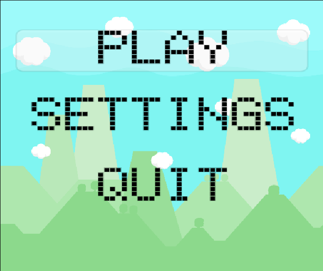
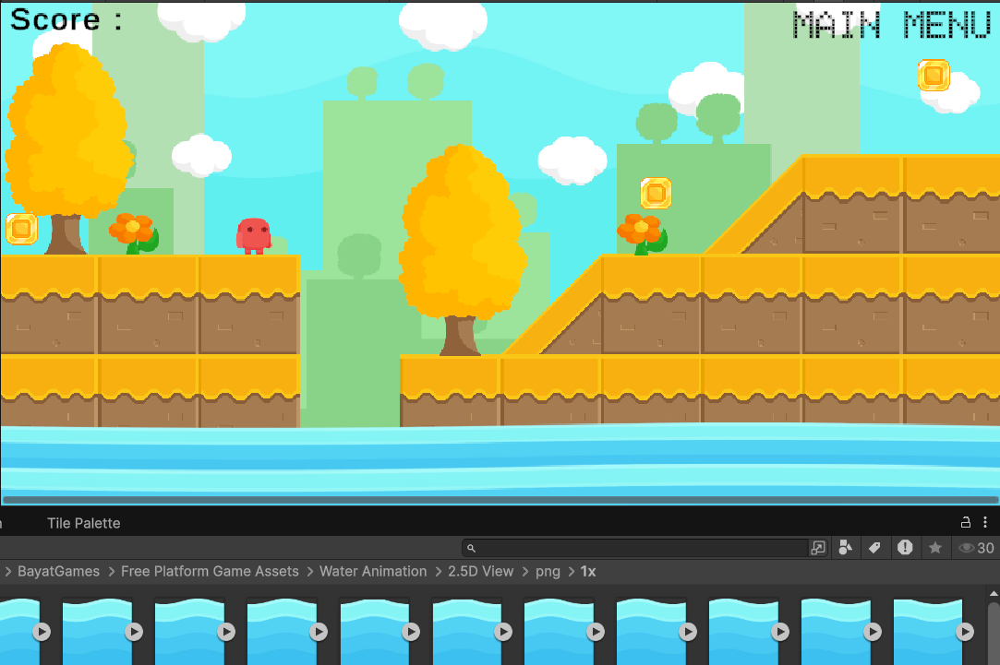
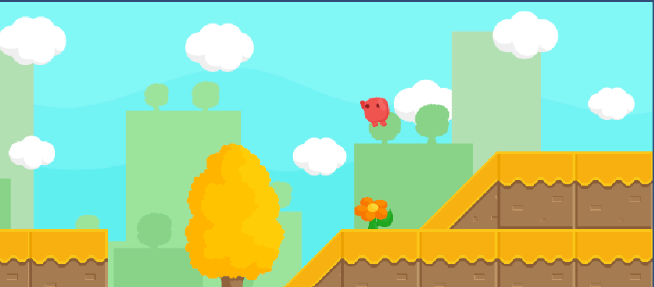

# 2D Platformer - Coin Collector

A simple yet fun 2D platformer game built with Unity. Run, jump, and collect coins while navigating through a tilemap-based level!

## Gameplay Features

- Smooth player movement and jump mechanics  
- Coin collection system (adds to score)  
- Idle, run, and jump animations using Unity's Animator  
- Map designed with Tilemap  
- Layered sprites with Sprite Renderer setup  
- Smooth camera follow system  
- Main menu with scene navigation

## Screenshots

### Main Menu

### In-Game Scene

### Jump Animation

## Scripts Overview

### `PlayerMovement.cs`
Handles:
- Horizontal movement
- Jumping (with force and grounded check)
- Animation parameters
- Coin score updates

### `Coin.cs`
- Detects collision with player
- Increases score
- Deactivates coin on collection

### `CameraFollow.cs`
- Smooth camera follow using `Vector3.SmoothDamp`

### `MainMenu.cs`
- Loads game scene
- Quits the game
- Returns to main menu

## Made With

- Unity 2D
- C#
- Tilemap system
- Sprite Renderer & Animator

---

